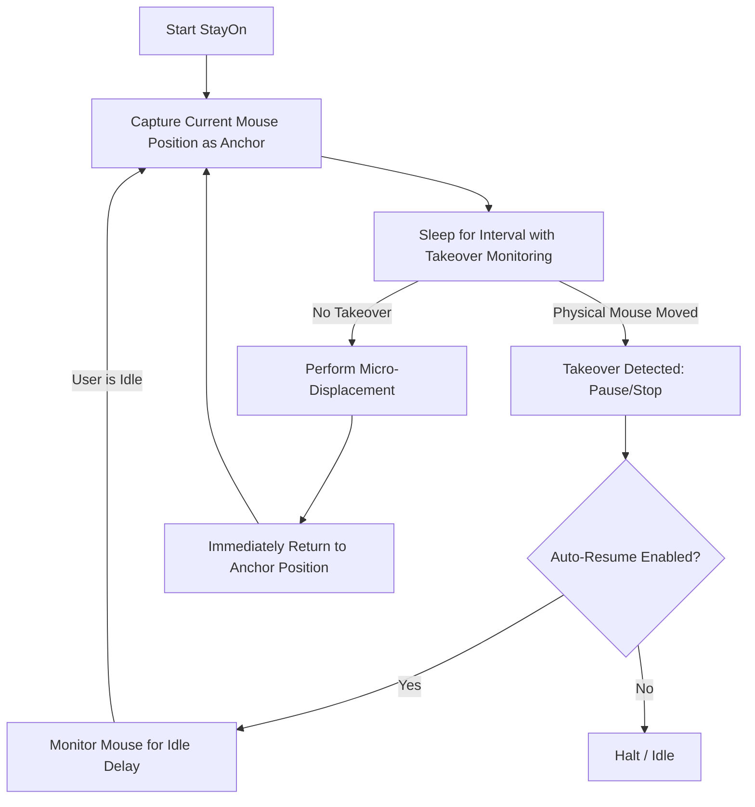

# StayOn ⚡
> **Keeps your workspace active, seamless, and awake.**

[-000000?style=for-the-badge&logo=apple&logoColor=white)](#)
[](#)
[](#)
[](#)

---

**StayOn** is a lightweight, intelligent macOS utility designed to keep your computer active, prevent screen lockouts, and maintain "Active" presence across workplace communication tools and activity monitors.

Unlike basic jiggler scripts that move your mouse wildly, **StayOn** uses **microscopic displacement with instant anchor-return** and **real-time physical takeover detection** — keeping your cursor virtually still while registering legitimate input events.

---

## 🌟 Key Features

- 🎯 **Subtle Micro-Displacement**: Nudges the cursor by a few configurable pixels and immediately returns it to its starting anchor point so your cursor never wanders off.
- ⚡ **Physical Takeover Detection**: Instantly pauses or stops the moment you touch your physical mouse or trackpad. Zero friction with your actual work.
- 🔄 **Smart Auto-Resume**: Automatically detects when you step away and resumes jiggling after a configurable idle delay.
- 🎨 **Modern Dark-Mode GUI**: Beautiful desktop interface with live status indicators, customizable range, interval sliders, and "Always on Top" pinning.
- 💻 **CLI / Terminal Mode**: Headless CLI mode support (`--cli`) for scriptable or minimalist workflows.
- 📦 **Portable Standalone App**: Build as a standalone macOS `.app` bundle that runs without needing terminal commands or virtual environments.

---

## 🎯 What Can StayOn Be Used For?

### 1. 🛡️ Activity Trackers & Work-Monitoring Software
Many remote monitoring software platforms (e.g., Time Doctor, Hubstaff, Upwork Tracker, Teramind, ActivTrak) track mouse and keyboard idle times to log inactivity or pause session timers. **StayOn** produces genuine hardware-level mouse coordinates at regular intervals, preventing tracking software from registering idle status.

### 2. 💬 Communication Apps (Slack, Teams, Skype, Discord)
Workplace chat tools automatically switch your avatar status to **"Away" / "Inactive"** after a few minutes of inactivity. **StayOn** ensures your status stays **"Active" / "Available" (🟢 Green)** even while reading documents, taking calls, or taking a quick break.

### 3. ☕ Prevent Screen Lockouts & Idle Sleep
Corporate laptops governed by MDM policies or strict IT rules often force screen locks after 2–5 minutes of inactivity. **StayOn** keeps your display awake and active without requiring administrator privileges or changes to system power settings.

### 4. 📽️ Long Downloads, Compilations & Presentations
Keep long-running file transfers, rendering pipelines, database migrations, or video presentations alive without the display dimming or entering sleep mode.

---

## 🚀 Quick Start

### Prerequisites
- macOS 12+ (Apple Silicon M1/M2/M3/M4 or Intel)
- Python 3.10+ (Recommended in virtual environment)

### Installation

1. **Clone the repository:**
   ```bash
   git clone https://github.com/krokxx03/StayOn.git
   cd StayOn
   ```

2. **Set up virtual environment & install dependencies:**
   ```bash
   python3 -m venv .venv
   source .venv/bin/activate
   pip install pyautogui pyinstaller
   ```

---

## 🖥️ Usage

### 1. Run the Desktop App (GUI)
Simply launch the desktop interface:
```bash
bash run.sh
# or
./.venv/bin/python juggle_cursor.py
```

### 2. Run in CLI / Terminal Mode
For lightweight, terminal-only execution:
```bash
# Basic run with auto-resume
./.venv/bin/python juggle_cursor.py --cli

# Custom range (20px) and fast interval (1s)
./.venv/bin/python juggle_cursor.py --cli --radius 20 --interval 1.0
```

#### CLI Options:
| Flag | Default | Description |
|---|---|---|
| `--cli` | *Off* | Run in terminal CLI mode instead of GUI |
| `--radius` | `4` | Movement radius in pixels |
| `--interval` | `3.0` | Interval between moves in seconds |
| `--no-auto-resume` | *False* | Disable automatic resume upon idle |

---

## 📦 Build Portable macOS Application (`StayOn.app`)

You can compile a standalone, portable `.app` bundle that you can move to your `/Applications` folder or Desktop:

```bash
bash build_app.sh
```

The compiled application will be generated in:
```
dist/StayOn.app
```

> **Note**: You can drag `StayOn.app` directly into `/Applications` and launch it like any standard macOS app!

---

## 🔒 macOS Permissions Guide

Because **StayOn** simulates input events to keep the system awake, macOS requires one-time Accessibility permission:

1. Open **System Settings** → **Privacy & Security** → **Accessibility**.
2. Click the `+` button (or toggle switch) and enable **StayOn** (or **Terminal** if running via script).
3. If prompted with a keychain access dialog, enter your Mac login password and select **"Always Allow"**.

---

## ⚙️ How It Works Under the Hood



---

## 📄 License

This project is licensed under the [MIT License](LICENSE).
